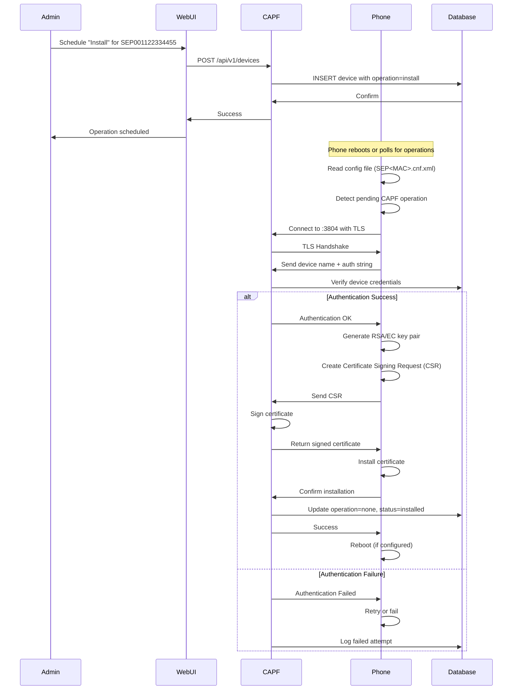

import { Card, CardGrid, Aside, Steps, Badge } from '@astrojs/starlight/components';

<Aside type="caution">
**⚠️ This page has been reorganized**

This content has been split into focused pages following the Diátaxis documentation framework:
- **Reference:** [CAPF Protocol Specification](/reference/protocol/capf/) - Technical specs and enrollment protocol
- **Explanation:** [Understanding CAPF](/explanation/understanding-capf/) - How CAPF works and certificate lifecycle
- **How-To:** [Debug CAPF Enrollment](/how-to/troubleshooting/debug-capf/) - Troubleshooting enrollment issues

This page will remain temporarily for reference but will be removed in the future. Please use the new pages above.
</Aside>

## Overview

The Certificate Authority Proxy Function (CAPF) implements Cisco's proprietary certificate enrollment protocol. It issues Locally Significant Certificates (LSC) to IP phones for encrypted signaling and media.

## Protocol Details

### Connection

<Card>
  - **Port**: <Badge text="3804" variant="note" />
  - **Transport**: TCP with TLS
  - **TLS Version**: TLS 1.0+ (phone dependent)
  - **Authentication**: Device name + optional password
</Card>

### Certificate Types

<CardGrid>
  <Card title="LSC" icon="document">
    **Locally Significant Certificate**

    - Issued by local CAPF service
    - Used for TLS/SRTP encryption
    - Not trusted outside the local deployment
    - Unique per device
  </Card>

  <Card title="MIC" icon="seti:config">
    **Manufacturer Installed Certificate**

    - Pre-installed by Cisco at factory
    - Globally trusted but less secure
    - Should be replaced with LSC for production
  </Card>
</CardGrid>

<Aside type="tip">
Always replace MIC certificates with LSC for production deployments to improve security.
</Aside>

## Enrollment Workflow

### Complete Certificate Installation Flow



## Operation Types

<CardGrid>
  <Card title="Install" icon="add-document">
    **Purpose**: Generate and install a new LSC on the device

    <Steps>
    1. Phone generates new key pair
    2. Phone creates CSR with device identity
    3. CAPF signs CSR with configured parameters
    4. Phone installs certificate
    5. Phone updates status
    </Steps>

    **Use Cases**:
    - First-time certificate enrollment
    - Re-enrollment after certificate expiry
    - Security policy enforcement
  </Card>

  <Card title="Fetch (Update)" icon="document">
    **Purpose**: Retrieve existing certificate from CAPF

    <Steps>
    1. Phone requests current certificate
    2. CAPF returns stored certificate
    3. Phone installs certificate
    4. Useful for device replacement
    </Steps>

    **Use Cases**:
    - Phone factory reset
    - Configuration restoration
    - Device swap scenarios
  </Card>

  <Card title="Delete" icon="close">
    **Purpose**: Remove LSC from device, revert to MIC

    <Steps>
    1. Phone connects to CAPF
    2. CAPF instructs phone to delete LSC
    3. Phone removes certificate
    4. Phone reverts to MIC for authentication
    </Steps>

    **Use Cases**:
    - Decommissioning devices
    - Security incident response
    - Troubleshooting enrollment issues
  </Card>

  <Card title="None" icon="information">
    **Purpose**: No operation scheduled

    **Status**: Default state, phone has no pending operations
  </Card>
</CardGrid>

## Authentication Modes

<CardGrid>
  <Card title="No Password" icon="warning">
    **Security Level**: <Badge text="Low" variant="caution" />

    **Use Case**: Testing, isolated networks

    **Behavior**:
    - Phone authenticates with device name only
    - No additional credentials required
    - CAPF accepts any phone with matching device name

    <Aside type="danger">
    **Risks**: Vulnerable to device impersonation. Not recommended for production!
    </Aside>
  </Card>

  <Card title="By Null String" icon="warning">
    **Security Level**: <Badge text="Low-Medium" variant="note" />

    **Use Case**: Automated deployments

    **Behavior**:
    - Phone sends empty authentication string
    - Slightly more secure than "no password"
    - Still minimal protection
  </Card>

  <Card title="By Password" icon="approve-check">
    **Security Level**: <Badge text="High" variant="success" />

    **Use Case**: Production deployments (Recommended)

    **Behavior**:
    - Admin sets unique password per device
    - Phone must provide matching password
    - User enters password on phone keypad
    - CAPF validates before proceeding

    <Aside type="tip">
    **Best Practices**:
    - Use strong passwords (12+ characters)
    - Unique password per device or device group
    - Document passwords securely
    - Rotate passwords periodically
    </Aside>
  </Card>
</CardGrid>

## Cryptographic Options

### RSA Key Sizes

Supported key sizes:
- **512 bits**: Legacy, insecure (not recommended)
- **1024 bits**: Minimum for older phones
- **2048 bits**: Standard (recommended)
- **3072 bits**: High security
- **4096 bits**: Maximum security (slower)

**Cisco 7962G Support**: 512-2048 bits

### Elliptic Curve (EC)

Supported curves:
- **P-256** (prime256v1): Standard
- **P-384** (secp384r1): High security
- **P-521** (secp521r1): Maximum security

**Cisco 7962G Support**: Limited EC support, RSA recommended

### Certificate Validity

**Default**: 365 days (configurable)

**Considerations**:
- Longer validity: Less frequent re-enrollment
- Shorter validity: Better security hygiene
- Coordinate with certificate expiry monitoring

## Cisco 7962G Configuration

### Firmware Requirements

**SCCP Firmware**:
- Minimum: 8.4(1)
- Recommended: 9.4(2) or later

**SIP Firmware**:
- Minimum: 9.0
- Recommended: Latest 9.x release

### Phone Configuration File

**File**: `SEP001122334455.cnf.xml`

```xml
<?xml version="1.0" encoding="UTF-8"?>
<device>
  <devicePool>
    <!-- CallManager Configuration -->
    <callManagerGroup>
      <members>
        <member priority="0">
          <callManager>
            <ports>
              <ethernetPhonePort>2000</ethernetPhonePort>
              <secureEthernetPhonePort>2443</secureEthernetPhonePort>
            </ports>
            <processNodeName>cucm.example.com</processNodeName>
          </callManager>
        </member>
      </members>
    </callManagerGroup>

    <!-- CAPF Configuration -->
    <capf>
      <serverName>capf.example.com</serverName>
      <port>3804</port>
      <timeout>10</timeout>
    </capf>

    <!-- TVS Configuration -->
    <tvs>
      <serverName>tvs.example.com</serverName>
      <port>2445</port>
      <timeout>10</timeout>
    </tvs>

    <!-- Enable Security -->
    <security>
      <enabled>true</enabled>
      <transportType>TLS</transportType>
    </security>
  </devicePool>

  <!-- Device Info -->
  <phoneLabel>Reception - Ext 1001</phoneLabel>
  <loadInformation>SCCP45.9-4-2SR3-1S</loadInformation>

  <!-- LSC Settings -->
  <certificateHash>
    <!-- Empty initially, populated after enrollment -->
  </certificateHash>
</device>
```

### Manual Enrollment on 7962G

**Step-by-Step Process**:

1. **Schedule Operation** (via Web UI or API):
   ```bash
   curl -X POST https://your-domain.com/api/capf/api/v1/devices \
     -H "Content-Type: application/json" \
     -d '{
       "device_name": "SEP001122334455",
       "operation": "install",
       "authentication": "by password",
       "password": "SecurePass123",
       "key_size": 2048
     }'
   ```

2. **On Phone** (option 1 - via menu):
   - Press **Settings** button
   - Navigate to **Security Configuration**
   - Select **LSC**
   - Choose **Update**
   - Phone prompts: "Enter Authentication String"
   - Enter password: `SecurePass123`
   - Press **Submit**
   - Phone displays: "Contacting CAPF server..."

3. **On Phone** (option 2 - via keycode):
   - Pick up handset
   - Dial: `**#` (keycode for LSC enrollment)
   - Enter authentication string when prompted
   - Press `#` to submit

4. **Monitor Progress**:
   - Phone status: "Generating keys..."
   - Phone status: "Requesting certificate..."
   - Phone status: "Installing certificate..."
   - Phone status: "Success - Rebooting"

5. **Verify Installation**:
   - Phone reboots
   - Check for padlock icon on phone display
   - Web UI shows device status: "Installed"
   - Audit log records successful enrollment

### Automatic Enrollment (Scheduled)

**Configuration**:
```xml
<!-- In SEP<MAC>.cnf.xml -->
<capf>
  <serverName>capf.example.com</serverName>
  <port>3804</port>
  <timeout>10</timeout>
  <autoUpgrade>true</autoUpgrade>
  <operationPollInterval>60</operationPollInterval>
</capf>
```

**Behavior**:
- Phone polls CAPF every 60 seconds
- Detects pending operation automatically
- Prompts user for authentication (if password required)
- Proceeds with enrollment without menu navigation

### Troubleshooting 7962G CAPF Issues

#### Phone Shows "CAPF Connection Failed"

**Causes**:
- CAPF service not running
- Network connectivity issue
- Wrong CAPF server address
- Port 3804 blocked by firewall

**Solutions**:
```bash
# Check CAPF service
docker compose ps capf
docker compose logs capf

# Test connectivity from phone network
nc -zv capf.example.com 3804

# Check firewall rules
sudo iptables -L -n | grep 3804
```

#### Phone Shows "Authentication Failed"

**Causes**:
- Wrong password entered
- Device not scheduled in CAPF database
- Authentication mode mismatch

**Solutions**:
1. Verify device exists:
   ```bash
   curl https://your-domain.com/api/capf/api/v1/devices/SEP001122334455
   ```

2. Check scheduled operation:
   ```json
   {
     "device_name": "SEP001122334455",
     "operation": "install",  // Must not be "none"
     "authentication": "by password",
     "password": "SecurePass123"
   }
   ```

3. Re-enter password carefully on phone
4. Check CAPF audit logs for authentication attempts

#### Enrollment Succeeds But Phone Still Insecure

**Causes**:
- CallManager not configured for TLS
- Phone config missing security settings
- TVS not validating CallManager certificate

**Solutions**:
1. Verify phone config has TLS enabled:
   ```xml
   <security>
     <enabled>true</enabled>
     <transportType>TLS</transportType>
   </security>
   ```

2. Upload CallManager certificate to TVS

3. Reboot phone to apply security settings

4. Check phone shows "Encrypted" indicator

#### Certificate Expired

**Symptoms**:
- Phone shows security warnings
- TLS connections fail
- Audit log shows certificate errors

**Solutions**:
1. Schedule "install" operation (generates new cert)
2. Set longer validity period (in CAPF settings)
3. Automate certificate renewal before expiry

## Protocol Implementation

### Server-Side (Simplified)

```python
async def handle_enrollment_request(reader, writer):
    # Receive device authentication
    device_name = await read_string(reader)
    auth_string = await read_string(reader)

    # Verify device
    device = db.get_device(device_name)
    if not device or device.operation == 'none':
        return error_response("No pending operation")

    # Validate authentication
    if not validate_auth(device, auth_string):
        audit_log.record(
            client_ip=get_client_ip(writer),
            operation='enroll',
            resource_id=device_name,
            success=False,
            error='Authentication failed'
        )
        return error_response("Authentication failed")

    # Receive CSR from phone
    csr_data = await read_csr(reader)

    # Generate certificate
    certificate = sign_certificate(
        csr=csr_data,
        validity_days=device.validity_days or 365,
        key_size=device.key_size
    )

    # Send certificate to phone
    await write_certificate(writer, certificate)

    # Update database
    device.certificate = certificate
    device.operation = 'none'
    device.serial_number = get_serial(certificate)
    db.update_device(device)

    # Audit log
    audit_log.record(
        client_ip=get_client_ip(writer),
        operation='enroll',
        resource_id=device_name,
        success=True
    )
```

## Security Considerations

### Device Impersonation

**Risk**: Attacker enrolls certificate for another device

**Mitigations**:
- Use "by password" authentication
- Unique passwords per device
- Monitor audit logs for suspicious enrollments
- Network segmentation (phones on isolated VLAN)

### Man-in-the-Middle

**Risk**: Attacker intercepts certificate enrollment

**Mitigations**:
- TLS encryption on port 3804
- Use trusted CA certificate for CAPF service
- Upload CAPF certificate to TVS
- Phones validate CAPF certificate before enrollment

### Certificate Misuse

**Risk**: Stolen LSC used for unauthorized access

**Mitigations**:
- Short certificate validity periods
- Certificate revocation capability
- Monitor for unusual device behavior
- Delete operation when device decommissioned

### Password Security

**Risk**: Weak or leaked authentication passwords

**Mitigations**:
- Strong password policy (12+ chars, mixed case, numbers, symbols)
- Unique passwords per device or group
- Secure password storage (encrypted database)
- Time-limited enrollment windows
- Audit all authentication attempts

## Best Practices

### Enrollment Strategy

1. **Initial Deployment**:
   - Schedule all devices for "install"
   - Use consistent authentication mode
   - Batch enrollment in groups
   - Monitor progress via audit logs

2. **Ongoing Management**:
   - Automated certificate renewal before expiry
   - Regular security audits
   - Backup device database
   - Document enrollment procedures

3. **Troubleshooting Approach**:
   - Check service health first
   - Verify network connectivity
   - Review device configuration
   - Examine audit logs
   - Test with single device

### Certificate Lifecycle

```
New Device → Schedule Install → Enroll → Monitor
                                  ↓
                            Certificate Active
                                  ↓
                         Near Expiry Warning
                                  ↓
                        Schedule Re-enrollment
                                  ↓
                            Renew Certificate
                                  ↓
                         Update → Monitor

Decommission → Schedule Delete → Remove LSC → Archive
```

### Monitoring

**Key Metrics**:
- Total devices enrolled
- Pending operations count
- Failed authentication attempts
- Certificates near expiry (within 30 days)
- Enrollment success rate

**Alerts**:
- Authentication failures (potential attack)
- Certificate expiry warnings
- CAPF service downtime
- Database errors

### Documentation

Maintain records of:
- Device names and MAC addresses
- Authentication passwords (encrypted)
- Enrollment dates
- Certificate serial numbers
- Expiry dates
- Responsible administrators

## API Integration

### Schedule Installation

```bash
curl -X POST https://your-domain.com/api/capf/api/v1/devices \
  -H "Content-Type: application/json" \
  -d '{
    "device_name": "SEP001122334455",
    "operation": "install",
    "authentication": "by password",
    "password": "SecurePass123",
    "key_size": 2048
  }'
```

### Check Device Status

```bash
curl https://your-domain.com/api/capf/api/v1/devices/SEP001122334455
```

Response:
```json
{
  "device_name": "SEP001122334455",
  "operation": "none",
  "authentication": "by password",
  "key_size": 2048,
  "certificate": "-----BEGIN CERTIFICATE-----\n...",
  "serial_number": "1234567890ABCDEF",
  "not_valid_before": "2024-01-01 00:00:00",
  "not_valid_after": "2025-01-01 00:00:00"
}
```

### Update Operation

```bash
curl -X PATCH https://your-domain.com/api/capf/api/v1/devices/SEP001122334455/operation \
  -H "Content-Type: application/json" \
  -d '{
    "operation": "delete"
  }'
```

### View Audit Logs

```bash
curl https://your-domain.com/api/capf/api/v1/audit-logs?operation=enroll&limit=50
```

## Related Documentation

- [TVS Protocol Details](/architecture/tvs-protocol)
- [Device Configuration Guide](/guides/device-configuration)
- [Security Best Practices](/security/best-practices)
- [API Reference](/api/overview)
