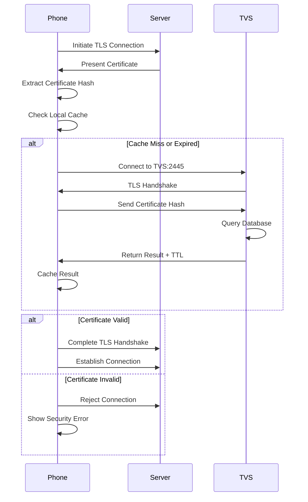

import { Card, CardGrid, Aside, Steps, Badge } from '@astrojs/starlight/components';

<Aside type="caution">
**⚠️ This page has been reorganized**

This content has been split into focused pages following the Diátaxis documentation framework:
- **Reference:** [TVS Protocol Specification](/reference/protocol/tvs/) - Technical specs and message formats
- **Explanation:** [Understanding TVS](/explanation/understanding-tvs/) - How TVS works and why it exists
- **How-To:** [Debug TVS Issues](/how-to/troubleshooting/debug-tvs/) - Troubleshooting guide

This page will remain temporarily for reference but will be removed in the future. Please use the new pages above.
</Aside>

## Overview

The Trust Verification Service (TVS) implements Cisco's proprietary certificate validation protocol. Phones use TVS to verify the authenticity of server certificates before establishing secure connections.

## Protocol Details

### Connection

<Card>
  - **Port**: <Badge text="2445" variant="note" />
  - **Transport**: TCP with TLS
  - **TLS Version**: TLS 1.0+ (phone dependent)
  - **Certificate**: Server must present valid TLS certificate
</Card>

### Message Format

TVS uses a binary protocol with fixed-size messages:

```
Request Message (from phone):
┌────────────────────────────────────────┐
│ Certificate Hash (SHA-256)             │  32 bytes
│ ┌──────────────────────────────────┐   │
│ │ Binary hash of certificate       │   │
│ └──────────────────────────────────┘   │
└────────────────────────────────────────┘

Response Message (to phone):
┌────────────────────────────────────────┐
│ Result Code                            │  1 byte
│ TTL (Time-To-Live)                     │  4 bytes (seconds)
│ Reserved                               │  N bytes
└────────────────────────────────────────┘

Result Codes:
- 0x00: Certificate not found
- 0x01: Certificate found and valid
```

## How Phones Use TVS

### Initial Configuration

Phones must be configured to use TVS via their configuration file (e.g., `SEP<MAC>.cnf.xml`):

```xml
<tvs>
  <serverName>tvs.example.com</serverName>
  <port>2445</port>
  <timeout>10</timeout>
</tvs>
```

### Validation Workflow



### Caching Behavior

<Aside type="tip">
Phones cache TVS responses to minimize network traffic and improve performance.
</Aside>

<Steps>

1. **Cache Key**: Certificate hash (SHA-256)

2. **Cache Value**: Valid/Invalid status

3. **Cache Duration**: TTL returned by TVS (typically 86400 seconds = 24 hours)

4. **Cache Invalidation**: Manual reboot or TTL expiration

</Steps>

## Certificate Roles

TVS supports different certificate roles to indicate certificate purpose:

### Role Types

| Role | Description | Used For |
|------|-------------|----------|
| `SAST` | System Administrator Security Token | Admin authentication |
| `CCM` | Cisco Unified Communications Manager | CallManager connections |
| `CCM+TFTP` | Combined CCM and TFTP | Unified service |
| `TFTP` | TFTP Server | Configuration downloads |
| `CAPF` | Certificate Authority Proxy Function | Certificate enrollment |
| `APP-SERVER` | Application Server | Third-party apps |
| `TVS` | Trust Verification Service | TVS itself |

### Role Matching

When a phone validates a certificate:
1. Phone determines required role based on connection type
2. TVS returns certificate with associated roles
3. Phone checks if required role is present
4. Connection proceeds if role matches

## Cisco 7962G Specifics

### Firmware Support

<Aside type="note">
The Cisco 7962G supports TVS with the following firmware versions:
</Aside>

<CardGrid>
  <Card title="SCCP Firmware" icon="seti:config">
    Version <Badge text="8.4(1)+" variant="tip" /> and later
  </Card>
  <Card title="SIP Firmware" icon="seti:config">
    Version <Badge text="9.x+" variant="tip" /> and later
  </Card>
</CardGrid>

### Configuration Example

For a Cisco 7962G phone with MAC address `001122334455`:

**File**: `SEP001122334455.cnf.xml`

```xml
<?xml version="1.0" encoding="UTF-8"?>
<device>
  <devicePool>
    <callManagerGroup>
      <members>
        <member priority="0">
          <callManager>
            <ports>
              <ethernetPhonePort>2000</ethernetPhonePort>
            </ports>
            <processNodeName>cucm.example.com</processNodeName>
          </callManager>
        </member>
      </members>
    </callManagerGroup>

    <!-- TVS Configuration -->
    <tvs>
      <serverName>tvs.example.com</serverName>
      <port>2445</port>
      <timeout>10</timeout>
    </tvs>

    <!-- Enable TLS -->
    <security>
      <enabled>true</enabled>
    </security>
  </devicePool>

  <!-- Phone Settings -->
  <phoneLabel>Reception Phone</phoneLabel>
  <loadInformation>SCCP45.9-4-2SR3-1S</loadInformation>
</device>
```

### Phone Behavior

**On Boot**:
1. Phone downloads configuration via TFTP
2. Parses TVS server settings
3. Attempts to connect to CallManager
4. CallManager presents certificate
5. Phone queries TVS for validation
6. If valid, phone registers with CallManager

**Security Indicators**:
- **Unlocked Padlock**: Connected but certificate not validated
- **Locked Padlock**: Connected with validated certificate
- **Security Error**: Certificate validation failed

### Troubleshooting 7962G TVS Issues

<Aside type="caution">
**Phone Shows "Security Error"**

This indicates the phone cannot validate server certificates.
</Aside>

Solutions:
- Check TVS service is running: `docker compose ps`
- Verify phone can reach TVS port <Badge text="2445" variant="note" />
- Check TVS has CallManager certificate uploaded
- Review TVS audit logs for validation attempts

<Aside type="caution">
**Phone Not Querying TVS**

The phone is not attempting certificate validation.
</Aside>

Solutions:
- Verify `<tvs>` section in phone config
- Check phone firmware version supports TVS
- Enable debug on phone: Settings → Security → Trust Verification
- Reboot phone to reload configuration

<Aside type="caution">
**Intermittent Validation Failures**

Connection issues between phone and TVS service.
</Aside>

Solutions:
- Check TVS service health
- Verify TTL is reasonable (86400 recommended)
- Check network connectivity between phone and TVS
- Review Docker logs: `docker compose logs tvs`

## Certificate Upload Process

<Aside type="tip">
Upload server certificates to TVS to enable phones to validate secure connections.
</Aside>

<Steps>

1. **Obtain Server Certificate**

   ```bash
   # Download certificate from server
   openssl s_client -connect cucm.example.com:443 \
     -showcerts </dev/null 2>/dev/null | \
     openssl x509 -outform PEM > cucm-cert.pem
   ```

2. **Upload to TVS**

   Via Web UI:
   - Navigate to **Certificates** page
   - Click **Upload Certificate**
   - Select certificate file
   - Choose roles (e.g., "CCM")
   - Click **Upload**

   Via API:
   ```bash
   curl -X POST https://your-tvs.example.com/api/tvs/api/v1/certificates \
     -F "certificate=@cucm-cert.pem" \
     -F "roles=CCM,TFTP"
   ```

3. **Verify Upload**

   Check certificate appears in TVS database:
   ```bash
   # Via web UI
   Navigate to Certificates → View list

   # Via API
   curl https://your-tvs.example.com/api/tvs/api/v1/certificates
   ```

4. **Test from Phone**

   - Reboot phone or clear certificate cache
   - Phone will query TVS on next connection
   - Check TVS audit logs for validation request
   - Verify phone shows locked padlock icon

</Steps>

## Protocol Implementation

The TVS service implements the protocol as follows:

### Server Code (Simplified)

```python
async def handle_validation_request(reader, writer):
    # Read certificate hash (32 bytes)
    cert_hash = await reader.read(32)
    hash_hex = cert_hash.hex()

    # Query database
    certificate = db.get_certificate_by_hash(hash_hex)

    if certificate:
        # Certificate found - return success
        result_code = 0x01
        ttl = certificate.ttl or 86400
    else:
        # Certificate not found - return failure
        result_code = 0x00
        ttl = 3600

    # Build response
    response = bytes([result_code]) + ttl.to_bytes(4, 'big')
    writer.write(response)
    await writer.drain()

    # Log to audit
    audit_log.record(
        client_ip=writer.get_extra_info('peername')[0],
        operation='validate',
        resource_id=hash_hex[:16],
        success=(result_code == 0x01)
    )
```

## Performance Optimization

### Database Indexing

The certificate_hash is the primary key, providing O(1) lookup:
```sql
CREATE TABLE certificates (
    certificate_hash TEXT PRIMARY KEY,
    ...
);
```

### Connection Pooling

TVS maintains persistent connections from phones:
- Phones may reuse TLS sessions
- Server uses asyncio for concurrent connections
- No connection limits (within system resources)

### Caching Strategy

**Server-Side**:
- No server-side caching needed (database is cache)
- SQLite provides adequate performance

**Client-Side** (Phone):
- TTL-based caching (default 24 hours)
- Reduces queries from thousands/day to a few
- Manual cache clear via reboot

## Security Considerations

### TLS Requirements

<Aside type="danger">
TVS security depends on proper TLS configuration.
</Aside>

- TVS server must have valid TLS certificate
- Phones validate TVS certificate (recursive trust)
- Use proper CA-signed certificate for TVS server
- Avoid self-signed unless phones trust root CA

### Certificate Pinning

<Aside type="note">
Phones may implement certificate pinning for TVS to prevent MITM attacks.
</Aside>

- First connection stores TVS certificate
- Subsequent connections must match
- Prevents Man-in-the-Middle attacks

### Attack Vectors

<CardGrid>
  <Card title="Man-in-the-Middle" icon="warning">
    **Risk**: Attacker intercepts TVS traffic

    **Mitigation**: TLS encryption, certificate validation
  </Card>

  <Card title="Denial of Service" icon="warning">
    **Risk**: Flood TVS with validation requests

    **Mitigation**: Rate limiting, firewall rules
  </Card>

  <Card title="Database Poisoning" icon="warning">
    **Risk**: Attacker uploads malicious certificates

    **Mitigation**: Authentication on management API
  </Card>
</CardGrid>

## Monitoring and Diagnostics

### Check TVS Service

```bash
# Service status
docker compose ps tvs

# View logs
docker compose logs tvs

# Test connectivity
openssl s_client -connect tvs.example.com:2445 -showcerts
```

### Audit Log Analysis

View recent validation attempts in web UI:
1. Navigate to **Admin** → **TVS Audit Logs**
2. Filter by operation: `validate`
3. Look for failed validations
4. Check client IP addresses

### Statistics

Monitor via API:
```bash
curl https://your-tvs.example.com/api/tvs/api/v1/stats
```

Returns:
```json
{
  "total_certificates": 5,
  "active_connections": 12,
  "validations_today": 1543,
  "cache_hit_rate": 0.95
}
```

## Best Practices

1. **Upload All Required Certificates**
   - CallManager certificates (all in cluster)
   - TFTP server certificates
   - CAPF certificate
   - Any custom application servers

2. **Use Appropriate Roles**
   - Match certificate purpose
   - Don't over-assign roles
   - Use `CCM+TFTP` for unified services

3. **Set Reasonable TTL**
   - Default: 86400 seconds (24 hours)
   - Too short: Excessive TVS queries
   - Too long: Delayed certificate revocation

4. **Monitor Audit Logs**
   - Regular review for failed validations
   - Track which phones query TVS
   - Identify configuration issues

5. **Backup Configuration**
   - Regular database backups via web UI
   - Store certificates in version control
   - Document role assignments

## Related Documentation

- [CAPF Protocol Details](/architecture/capf-protocol)
- [Device Configuration Guide](/guides/device-configuration)
- [API Reference](/api/overview)
