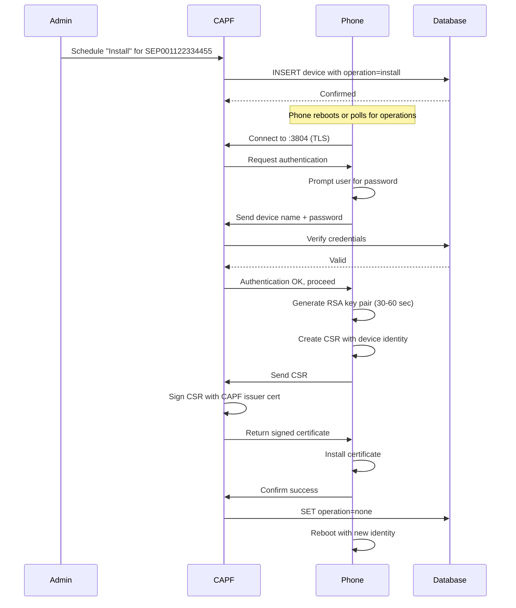

import { Card, CardGrid, Aside } from '@astrojs/starlight/components';

## What is CAPF?

The Certificate Authority Proxy Function (CAPF) is a **certificate enrollment service** for Cisco IP phones. It issues Locally Significant Certificates (LSC) that give each phone a unique cryptographic identity for secure communications.

Think of CAPF as the "ID card issuer" for your phone system - it creates and distributes trusted credentials to phones, enabling them to prove their identity and establish encrypted connections.

## Why CAPF Exists

### The Identity Problem in Enterprise Telephony

Cisco IP phones need digital certificates for two key purposes:
1. **Authentication** - Prove their identity to CallManager
2. **Encryption** - Establish TLS for signaling and SRTP for media

Traditionally, phones came with **Manufacturer Installed Certificates (MIC)**:
- Pre-installed at the Cisco factory
- Globally unique but generic
- Shared trust model (all Cisco devices trust the same root CA)
- Can't be revoked or replaced individually

This creates problems for enterprises:
- **No control** over certificate lifecycle
- **Can't revoke** compromised device certificates
- **Shared trust** means one compromise affects all devices
- **Long validity** periods (10+ years) violate security policies

### The LSC Solution

CAPF solves these problems by issuing **Locally Significant Certificates (LSC)**:
- Generated on-demand for each phone
- Issued by your local CAPF service (you control the CA)
- Customizable validity periods
- Can be revoked or rotated
- Unique to your deployment (not trusted elsewhere)

<CardGrid>
  <Card title="MIC Approach" icon="warning">
    **Factory-Installed Identity**

    - Cisco controls the CA
    - Long validity (10+ years)
    - Cannot revoke individual certs
    - Same root CA for all Cisco devices
    - One-size-fits-all
  </Card>

  <Card title="LSC Approach" icon="approve-check">
    **Enterprise-Controlled Identity**

    - You control the CA (via CAPF)
    - Custom validity (default 1 year)
    - Full revocation control
    - Isolated trust domain
    - Tailored to your security policy
  </Card>
</CardGrid>

## LSC vs MIC: The Trade-Offs

### Why Not Just Use MIC?

MIC certificates work, so why bother with LSC? Consider these scenarios:

**Scenario 1: Device Theft**
- **With MIC**: Certificate can't be revoked. Stolen phone can impersonate legitimate device forever.
- **With LSC**: Revoke the LSC, issue new certificate to replacement phone. Stolen phone becomes useless.

**Scenario 2: Compliance Requirements**
- **With MIC**: 10-year certificate violates your "1-year maximum validity" security policy.
- **With LSC**: Set validity to 365 days, automated renewal. Meets compliance.

**Scenario 3: M&A Integration**
- **With MIC**: Acquired company's phones trust different root CA. Complex trust configuration.
- **With LSC**: Issue LSCs from your CAPF. All phones trust your CA uniformly.

### When MIC is Acceptable

MIC certificates are fine for:
- Lab/development environments
- Non-production networks
- Temporary deployments
- Scenarios where certificate management overhead isn't justified

LSC is recommended for:
- Production deployments
- Regulated industries (finance, healthcare, government)
- High-security environments
- Large-scale deployments with lifecycle management

## How Certificate Enrollment Works

### The Enrollment Dance

CAPF enrollment is a **multi-party protocol** involving:
1. **Administrator** - Schedules the operation via Web UI/API
2. **CAPF Service** - Issues certificates based on schedule
3. **Phone** - Generates keys and requests certificate
4. **Database** - Tracks device state and operations

Here's how they collaborate:



### Key Insights

<CardGrid>
  <Card title="On-Device Key Generation" icon="star">
    Phones generate their own private keys **on the device**. The private key never leaves the phone - CAPF only sees the public key (in the CSR). This is fundamental to security.
  </Card>

  <Card title="User Authentication" icon="approve-check">
    The password authentication step prevents unauthorized devices from enrolling. Without the correct password, a rogue device can't get a valid certificate, even if it knows the device name.
  </Card>

  <Card title="Stateful Operation" icon="information">
    CAPF uses a **database-driven state machine**. The phone doesn't tell CAPF what to do - the administrator pre-schedules the operation, and the phone executes it when ready.
  </Card>
</CardGrid>

## Operation Types and Their Purpose

CAPF supports four operation types, each solving a different lifecycle need:

### Install: Initial Enrollment

**Purpose**: Generate a brand new certificate for a phone.

**When Used**:
- First-time phone deployment
- MIC → LSC migration
- Certificate expiration (generate new cert)
- Security policy enforcement

**What Happens**:
1. Phone generates new RSA/EC key pair
2. Phone creates CSR with device identity
3. CAPF signs CSR, creating certificate
4. Phone installs certificate
5. Operation marked complete

**Result**: Phone has fresh LSC with new keys.

### Fetch: Certificate Recovery

**Purpose**: Retrieve an existing certificate from CAPF without generating new keys.

**When Used**:
- Phone factory reset (lost certificate)
- Configuration restoration
- Device replacement (reuse certificate)

**What Happens**:
1. Phone requests existing certificate
2. CAPF returns stored certificate from database
3. Phone installs retrieved certificate

**Result**: Phone has same certificate it had before.

<Aside type="note">
**Limitation**: Fetch only works if CAPF stored the certificate. If the phone generated keys locally (typical), the private key is lost after factory reset, and Fetch won't work. You'll need Install instead.
</Aside>

### Delete: Certificate Removal

**Purpose**: Remove LSC from phone, reverting to MIC.

**When Used**:
- Device decommissioning
- MIC → LSC migration (reverse)
- Troubleshooting enrollment issues
- Security incident response

**What Happens**:
1. Phone connects to CAPF
2. CAPF instructs phone to delete LSC
3. Phone removes certificate and keys
4. Phone reverts to using MIC

**Result**: Phone no longer has LSC, back to MIC-based auth.

### None: Idle State

**Purpose**: No pending operation.

**When Used**:
- Default state after enrollment completes
- Normal operational state
- After operation is cleared

**What Happens**: Nothing. Phone operates normally with current certificate.

## Authentication Modes Explained

### The Authentication Dilemma

CAPF needs to prevent **device impersonation**: what stops an attacker from connecting to CAPF and requesting a certificate for someone else's phone?

Cisco designed three authentication modes with different security/usability trade-offs:

### No Password: Convenience Over Security

**How It Works**: Phone authenticates with device name only.

**Security Model**: "If you know the device name, you can enroll."

**Threat Model**:
- ✅ Protects against random attacks (attacker must know device naming scheme)
- ❌ No protection against targeted attacks (attacker learns device name from config files)
- ❌ Vulnerable to network sniffing (device names are in phone configs)

**Appropriate Use Cases**:
- Isolated test labs
- Air-gapped networks
- Environments where physical security is strong
- Rapid prototyping/development

### By Null String: Minimal Barrier

**How It Works**: Phone sends empty string as authentication.

**Security Model**: "Phone must explicitly opt-in to enrollment, but no credential required."

**Threat Model**:
- ✅ Slightly better than no password (explicit opt-in)
- ❌ Still vulnerable to impersonation
- ❌ Minimal real security benefit

**Appropriate Use Cases**:
- Automated deployment scripts
- Scenarios where physical access to phone is required (press button to trigger)
- Marginal improvement over "no password"

### By Password: Proper Authentication

**How It Works**: Administrator sets password, user enters it on phone during enrollment.

**Security Model**: "You must know both the device name AND the secret password."

**Threat Model**:
- ✅ Strong protection against impersonation
- ✅ Requires both network access AND secret knowledge
- ✅ Audit trail of authentication attempts
- ⚠️ Password must be transmitted to phone (in-person or secure channel)

**Appropriate Use Cases**:
- Production deployments
- Compliance environments
- Any scenario where security matters

### Password Strategy Patterns

**Per-Device Passwords**:
- Highest security: each phone has unique password
- Management overhead: tracking 100s of passwords
- Best for high-security environments

**Group Passwords**:
- Medium security: floor/department shares password
- Manageable: dozens of passwords, not hundreds
- Balanced approach for enterprises

**Temporary Window Passwords**:
- One-time password valid for enrollment window
- Reduces password storage requirements
- Good for bulk deployments

## Cryptographic Choices and Their Impact

### RSA vs Elliptic Curve

CAPF supports both RSA and Elliptic Curve (EC) cryptography. Why choose one over the other?

**RSA Characteristics**:
- Mature, widely supported
- Well-understood security properties
- Larger key sizes needed (2048-bit standard)
- Slower key generation (30-60 seconds on 7962G)
- Compatible with all Cisco phones

**EC Characteristics**:
- Newer, more efficient
- Smaller keys for equivalent security (256-bit EC ≈ 3072-bit RSA)
- Faster key generation (5-10 seconds)
- Limited phone support (especially older models)

**Cisco 7962G Reality**: Use RSA-2048. EC support is limited and untested on these older phones.

### Key Size Trade-Offs

Larger keys mean stronger security but slower performance:

**512-bit RSA**:
- Insecure (factorable in minutes with modern hardware)
- Never use, even in labs
- Exists only for ancient phone compatibility

**1024-bit RSA**:
- Weak by modern standards (deprecated by NIST)
- Acceptable for lab use only
- Fast key generation (10-15 seconds)

**2048-bit RSA** ⭐:
- Industry standard
- Strong security through 2030+
- Reasonable performance (30-60 seconds)
- **Recommended for production**

**3072/4096-bit RSA**:
- Overkill for phone certificates
- Very slow generation (minutes on older phones)
- Cisco 7962G doesn't support it
- Only use if compliance mandates

### Certificate Validity Periods

How long should certificates last?

**Short Validity (30-90 days)**:
- ✅ Limits exposure window if compromised
- ✅ Forces regular key rotation
- ❌ Frequent re-enrollment overhead
- ❌ User interruption every few months

**Standard Validity (1 year)** ⭐:
- ✅ Balances security and convenience
- ✅ Annual maintenance window
- ✅ Aligns with most security policies
- **Recommended for most deployments**

**Long Validity (2-10 years)**:
- ✅ Minimal operational overhead
- ✅ Set and forget approach
- ❌ Long exposure if compromised
- ❌ May violate compliance policies

## The CAPF Trust Chain

### How Phones Trust CAPF

There's a **bootstrapping problem**: phones need to validate CAPF's certificate before trusting certificates it issues. But how do they initially trust CAPF?

**The Trust Chain**:
```
ITL File (signed) → CAPF Certificate → Phone LSC
```

1. **ITL File**: Contains hash of CAPF certificate, signed by trusted signer
2. **Phone validates ITL**: Checks signature using embedded CA certificates or MIC
3. **Phone trusts CAPF**: ITL says "this hash is the CAPF certificate"
4. **CAPF enrolls phone**: Phone accepts certificates signed by CAPF

This is similar to TVS's recursive trust problem - CAPF security depends on ITL integrity.

### The CAPF Issuer Certificate

CAPF itself needs a certificate to sign phone certificates. This **CAPF issuer certificate** is special:
- **Self-signed** or issued by internal CA
- **Long-lived** (multiple years)
- **Critical security asset** - if compromised, entire phone trust breaks
- **Should be stored securely** (HSM in production)

When you rotate the CAPF issuer certificate:
1. Generate new issuer certificate
2. Update ITL files with new CAPF certificate hash
3. Deploy new ITL to phones
4. Phones re-enroll with new CAPF issuer
5. Archive old issuer certificate

## CAPF in the Security Ecosystem

CAPF doesn't operate in isolation - it's part of the phone security architecture:

```
┌─────────────────────────────────────────────┐
│ Phone Security Ecosystem                     │
│                                              │
│  ┌─────────┐     ┌─────────┐     ┌────────┐│
│  │   ITL   │────▶│  CAPF   │────▶│  TVS   ││
│  │  Files  │     │ Service │     │Service ││
│  └─────────┘     └─────────┘     └────────┘│
│       │               │               │     │
│       │               │               │     │
│       └───────┬───────┴───────┬───────┘     │
│               │               │             │
│               ▼               ▼             │
│          ┌─────────────────────────┐        │
│          │   Phone Trust Model     │        │
│          └─────────────────────────┘        │
└─────────────────────────────────────────────┘
```

**ITL Files**: Establish initial trust for CAPF and TVS certificates

**CAPF**: Issues LSC certificates to phones for authentication and encryption

**TVS**: Validates server certificates (including CallManager's certificate)

**Phone**: Uses LSC to authenticate to CallManager, uses TVS to validate CallManager's certificate

### Operational Interdependencies

**Certificate Expiration Cascade**:
- CAPF issuer certificate expires → All phone LSCs become un-issuable
- Phone LSC expires → Phone can't authenticate to CallManager
- CallManager certificate expires → TVS validates OK, but CallManager can't accept connections

**Trust Relationship Dependencies**:
- ITL signature breaks → Phones can't trust CAPF or TVS
- CAPF issuer private key lost → Can't issue new LSCs (disaster recovery needed)
- TVS database lost → Phones can't validate any server certificates

## Design Philosophy

### Why the State Machine Model?

CAPF uses a **pull-based, state-driven** model rather than push-based commands. Why?

**State Machine Benefits**:
- **Idempotent**: Phone can retry without duplicating enrollment
- **Audit Trail**: Database records operation intent and completion
- **Asynchronous**: Phone enrolls when convenient (no real-time coordination)
- **Recoverable**: If enrollment fails, state persists for retry

**Alternative (Command-Based)** would require:
- Real-time connection when admin schedules operation
- Retry logic in the phone or admin interface
- No clear audit trail of intent vs execution
- Synchronization complexity

The state machine trades **immediacy** for **reliability** - perfect for enterprise operations where correctness matters more than speed.

### Why Passwords on Phone Keypads?

Authentication requires users to **manually enter passwords on the phone**. This seems archaic - why not pre-shared secrets in config files?

**Security Reasoning**:
- **Proof of physical access**: User must be at the phone
- **Human in the loop**: Prevents fully automated attacks
- **No secrets in config files**: Password isn't stored in XML (which is transferred unencrypted via TFTP)
- **Temporary credential**: Password only needed during enrollment, not operational

This design **prioritizes security over convenience** - appropriate for certificate enrollment, which is infrequent and critical.

### Centralized vs Distributed CA

Why does CAPF centralize certificate issuance rather than letting phones generate self-signed certificates?

**Centralization Benefits**:
- **Consistent policy**: All certificates have same validity, key size, attributes
- **Revocation control**: Central CA can revoke any phone's certificate
- **Audit trail**: All enrollments logged in one place
- **Trust management**: Phones only need to trust one CA (CAPF issuer)

**Trade-Off**: Single point of failure. If CAPF is down, no enrollments happen. But this matches enterprise reality - certificate issuance is infrequent, and brief CAPF downtime is acceptable.
