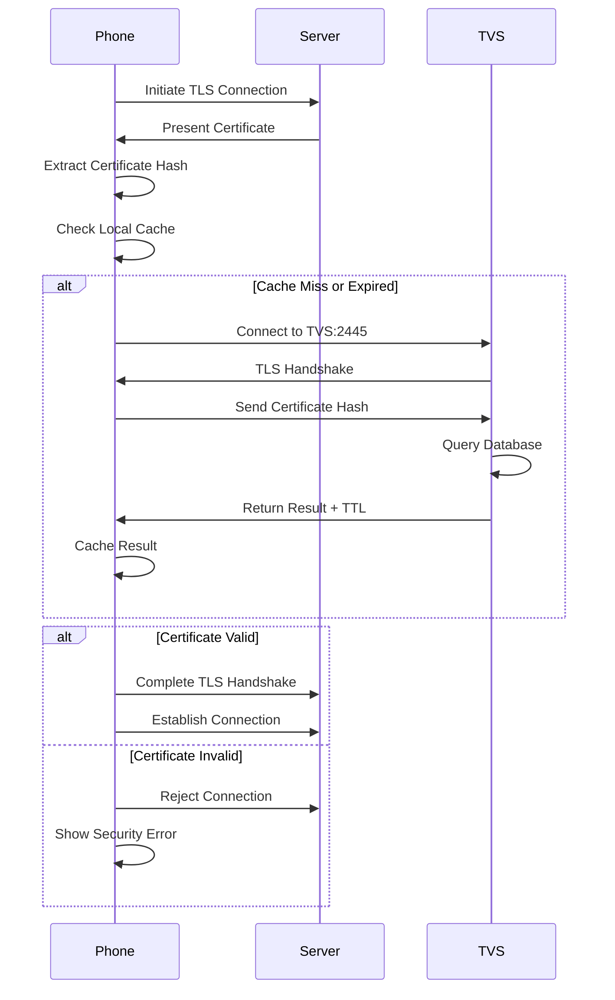

import { Card, CardGrid, Aside } from '@astrojs/starlight/components';

## What is TVS?

The Trust Verification Service (TVS) is a **certificate validation oracle** for Cisco IP phones. It answers a single question: "Is this server certificate trusted?"

Unlike traditional PKI where devices validate certificates themselves using root CAs, Cisco phones **delegate** certificate validation to a centralized TVS server. This architectural choice reflects the reality of enterprise telephony deployments.

## Why TVS Exists

### The Enterprise Telephony Problem

<CardGrid>
  <Card title="Certificate Management Complexity" icon="puzzle">
    Enterprise call managers use certificates from various CAs - internal PKI, commercial CAs, self-signed certificates. Phones would need to trust dozens of root CAs.
  </Card>

  <Card title="Limited Phone Storage" icon="warning">
    IP phones have constrained storage. Embedding multiple root CA certificates in firmware is impractical. TVS moves this burden to a server.
  </Card>

  <Card title="Centralized Control" icon="setting">
    Administrators need centralized control over which certificates phones trust. TVS provides a single point of trust management.
  </Card>

  <Card title="Dynamic Trust Updates" icon="rocket">
    When certificates change (renewal, replacement), TVS allows instant trust updates without phone firmware changes or reboots.
  </Card>
</CardGrid>

## The Trust Model

### Traditional PKI vs. TVS

**Traditional PKI Model:**
```
┌──────────────────────────────────────────┐
│ Phone validates certificate directly    │
│  ├─ Has root CA certificates embedded   │
│  ├─ Validates chain of trust            │
│  ├─ Checks expiration, revocation       │
│  └─ Makes trust decision locally        │
└──────────────────────────────────────────┘
```

**Cisco TVS Model:**
```
┌──────────────────────────────────────────┐
│ Phone delegates validation to TVS        │
│  ├─ Receives server certificate          │
│  ├─ Computes SHA-256 hash                │
│  ├─ Asks TVS: "Is this hash trusted?"    │
│  └─ Trusts TVS's answer                  │
└──────────────────────────────────────────┘
```

### The Recursive Trust Problem

<Aside type="note">
TVS creates an interesting **bootstrapping problem**: phones must validate TVS's own certificate before asking it to validate other certificates.
</Aside>

This is solved through **ITL files** (Initial Trust List):
1. Phones receive ITL file via TFTP (signed)
2. ITL contains TVS certificate hash
3. Phone trusts TVS certificate from ITL
4. Phone can now query TVS for other certificates

This creates a chain: **ITL signature → TVS certificate → Server certificates**

## How Validation Works

### The Validation Workflow



### Key Insights

<CardGrid>
  <Card title="Hash-Based Validation" icon="approve-check">
    TVS validates certificate **identity** (hash), not **validity** (expiration, revocation). This is intentional - phones only care if administrators trust this specific certificate.
  </Card>

  <Card title="Positive Security Model" icon="information">
    TVS uses an **allowlist** approach. Only explicitly uploaded certificates are trusted. Unknown certificates are rejected by default.
  </Card>

  <Card title="No Chain Validation" icon="warning">
    TVS doesn't validate certificate chains or check CRLs/OCSP. It's a simple "is this hash in the database?" lookup. Chain validation is **your** responsibility before uploading.
  </Card>
</CardGrid>

## Caching Architecture

### Why Phones Cache

Without caching, phones would query TVS on **every TLS connection**:
- Initial boot and registration
- Configuration file downloads
- Firmware downloads
- Media server connections
- Every reboot or network change

For a 100-phone deployment, this could mean **thousands of queries per day**, creating unnecessary network traffic and TVS load.

### How Caching Works

**Cache Mechanism:**
1. Phone queries TVS for certificate hash
2. TVS returns result + TTL (time-to-live)
3. Phone stores result in volatile memory
4. Subsequent connections use cached result
5. Cache expires after TTL seconds

**Cache Invalidation:**
- TTL expiration (typically 24 hours)
- Phone reboot (cache is volatile)
- Manual cache clear (via phone menu)

**Cache Benefits:**
- **Reduces network traffic** - Queries drop from 1000s/day to a few
- **Improves performance** - No network round-trip for cached certs
- **Increases reliability** - Phones work if TVS temporarily unavailable

### TTL Trade-offs

<Aside type="tip">
The TTL value controls the balance between efficiency and security responsiveness.
</Aside>

**Short TTL (1-4 hours):**
- ✅ Fast certificate revocation
- ✅ Quick trust changes
- ❌ More TVS queries
- ❌ Higher network traffic

**Long TTL (24-48 hours):**
- ✅ Minimal TVS queries
- ✅ Better performance
- ❌ Delayed revocation
- ❌ Phones cache stale data longer

**Recommended**: 86400 seconds (24 hours) balances efficiency and security for most deployments.

## Certificate Roles

### Purpose of Roles

Roles provide **context** about why a certificate exists in TVS. When a phone validates a certificate, it knows what role it needs:
- Connecting to CallManager? Need `CCM` role
- Downloading config from TFTP? Need `TFTP` role
- Enrolling with CAPF? Need `CAPF` role

Roles prevent **privilege escalation** - a TFTP server certificate can't be used to impersonate CallManager.

### Role Matching Logic

The phone's validation logic:
```
required_role = determine_role_for_connection()
certificate_roles = tvs.validate(cert_hash)

if required_role in certificate_roles:
    trust_certificate()
else:
    reject_connection()
```

## Performance Characteristics

### Why TVS Scales Well

<CardGrid>
  <Card title="Simple Protocol" icon="rocket">
    TVS protocol is trivial: send 32 bytes, receive 5 bytes. No complex parsing or processing. Handles thousands of requests per second.
  </Card>

  <Card title="O(1) Lookups" icon="approve-check">
    Database uses certificate hash as primary key. Every validation is a single indexed lookup. No table scans, no joins.
  </Card>

  <Card title="Client-Side Caching" icon="star">
    Phones cache results for 24 hours. A 1000-phone deployment might generate only 50-100 queries per day after steady state.
  </Card>

  <Card title="Stateless Design" icon="information">
    Each validation request is independent. No session state, no connection pooling complexity. Easy to scale horizontally.
  </Card>
</CardGrid>

### Scaling Considerations

**Single Server**: Adequate for 1000+ phones
**High Availability**: Deploy multiple TVS servers, phones try them in sequence
**Load Balancing**: Not typically needed due to caching and lightweight protocol
**Database**: SQLite is sufficient; no need for PostgreSQL/MySQL for most deployments

## Security Model

### Threat Landscape

TVS's security model addresses these threats:

**Man-in-the-Middle Attacks:**
- **Threat**: Attacker intercepts phone connections
- **Defense**: TVS connection itself uses TLS
- **Limitation**: Phone must trust TVS certificate (via ITL)

**Rogue Server Impersonation:**
- **Threat**: Attacker runs fake CallManager
- **Defense**: Phone only trusts certificates in TVS database
- **Limitation**: Requires administrator to only upload legitimate certificates

**Certificate Poisoning:**
- **Threat**: Attacker uploads malicious certificates to TVS
- **Defense**: API authentication (firewall, mTLS, API keys)
- **Limitation**: Currently no built-in authentication (deployment responsibility)

### The TVS Trust Anchor

<Aside type="caution">
**Critical Insight**: TVS becomes a **single point of trust** for the entire phone system.
</Aside>

If an attacker compromises TVS:
- They can make phones trust malicious certificates
- They can reject legitimate certificates (DoS)
- They control the entire phone trust model

This makes **TVS security** paramount:
- Protect TVS server like you protect CallManager
- Restrict network access to TVS ports
- Authenticate management API access
- Monitor audit logs for suspicious activity
- Regular backups of certificate database

## Integration with Other Services

### TVS in the Certificate Ecosystem

TVS doesn't operate in isolation:

```
┌─────────────────────────────────────────────────┐
│ Certificate Trust Ecosystem                     │
│                                                  │
│  ┌─────────┐      ┌─────────┐      ┌─────────┐ │
│  │   ITL   │─────▶│   TVS   │◀─────│  Admin  │ │
│  │  Files  │      │ Service │      │   API   │ │
│  └─────────┘      └─────────┘      └─────────┘ │
│       │                 │                 │     │
│       │                 │                 │     │
│       ▼                 ▼                 ▼     │
│  ┌─────────────────────────────────────────┐   │
│  │          Phone Trust Decision           │   │
│  └─────────────────────────────────────────┘   │
└─────────────────────────────────────────────────┘
```

**ITL Files**: Provide initial trust for TVS certificate
**CAPF**: Issues LSC certificates that TVS may validate
**CallManager**: Uses certificates that TVS validates
**Admin API**: Manages which certificates TVS trusts

### Operational Workflows

**Certificate Renewal:**
1. CallManager certificate expires soon
2. Administrator generates new certificate
3. Administrator uploads new cert to TVS
4. Both old and new certs valid during transition
5. CallManager switches to new certificate
6. Remove old cert from TVS after transition complete

**New Service Deployment:**
1. Deploy new application server
2. Generate certificate for server
3. Upload certificate to TVS with `APP-SERVER` role
4. Phones can now validate connections to server

**Certificate Revocation:**
1. Certificate compromised
2. Remove certificate from TVS database
3. Phones' caches expire (within 24 hours with default TTL)
4. Connections using compromised cert rejected

## Design Philosophy

### Simplicity Over Flexibility

TVS intentionally keeps the protocol **simple**:
- No complex validation rules
- No policy language
- No fine-grained access control
- Just "is this hash trusted?"

This simplicity is a **strength**:
- Easy to implement
- Hard to misconfigure
- Fast and reliable
- Easy to debug

### Centralization Over Distribution

By centralizing trust decisions, TVS trades **autonomy** for **control**:
- Phones can't make independent trust decisions
- Administrators have complete control
- Changes propagate to all phones
- Single source of truth

This matches enterprise telephony needs where **consistency** and **manageability** trump device autonomy.
